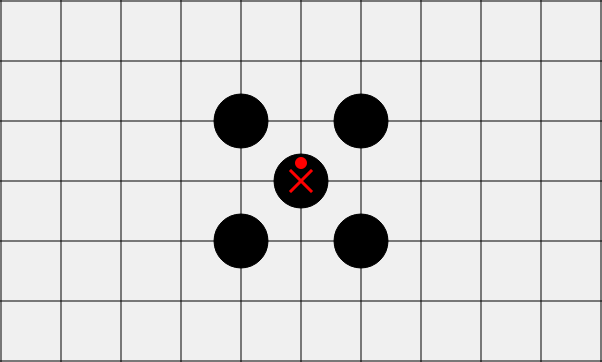

# 关于五子棋的禁手规则

### 1 禁手规则

​	在五子棋的所有正规比赛中，为避免黑棋优势过大，对黑棋的落子进行限制，称为“禁手”。

​	禁手分为以下三种：

- ​    长连禁手
- ​    四四禁手
- ​    三三禁手

​	黑棋在禁手点落子判负。

​	当禁手与黑棋连五同时形成时，判黑棋胜，即连五优先于禁手。

### 2 与禁手相关的棋型

- 长连：六个或以上的同色棋子连成一条线

- 连五：恰好有五个同色棋子连成一条线
- 活四：对于某四个黑子，有且只有两个空点，使得这四个黑子和空点能形成连五
- 冲四：对于某四个黑子，有且只有一个空点，使得这四个黑子和空点能形成连五

- 活三：存在点p, 使得本方下在p时，可以形成包含点p的活四

### 3 禁手的定义

#### 长连禁手

黑棋落子后，形成一个或以上的长连

| 举例                                                         | 说明                             |
| ------------------------------------------------------------ | -------------------------------- |
|  | 长连禁手，白棋胜                 |
|  | 长连禁手，白棋胜                 |
|  | 黑棋胜，因为长连的同时形成了连五 |

#### 四四禁手

黑棋落子后，产生两个或以上的活四或冲四

| 举例                                                         | 说明                           |
| ------------------------------------------------------------ | ------------------------------ |
|  | 四四禁手（双活四），白棋胜     |
|  | 四四禁手（1活四1冲四），白棋胜 |
|  | 四四禁手（双冲四），白棋胜     |
|  | 四四禁手（双冲四），白棋胜     |
|  | 无禁手，因为只有右侧一个冲四   |
|                                                              |                                |

#### 三三禁手

| 举例                                                         | 说明             |
| ------------------------------------------------------------ | ---------------- |
|  | 三三禁手，白棋胜 |
|  | 三三禁手，白棋胜 |
|  |                  |

